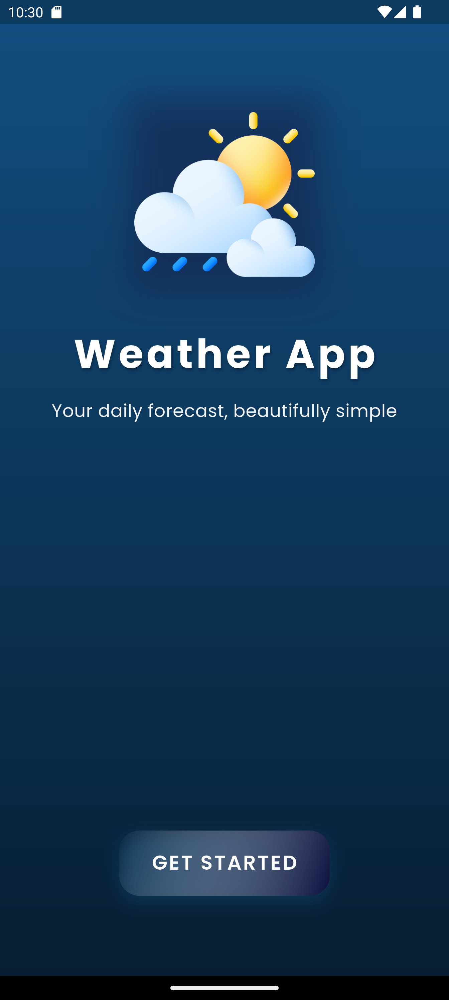
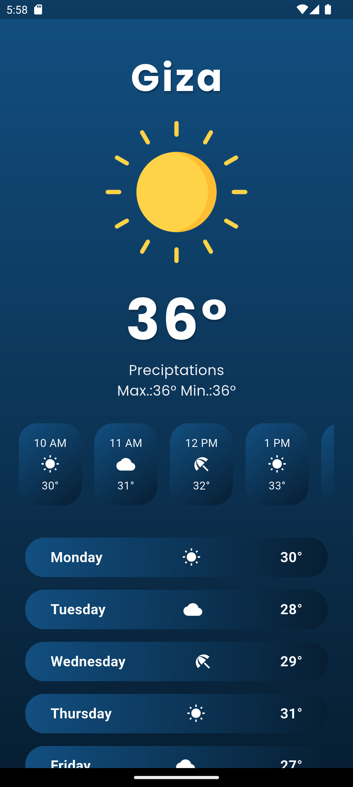

# Weather App 🌤️

A beautiful and intuitive Flutter weather application that provides real-time weather information with a modern, gradient-based UI design.

## 📱 Screenshots

| Welcome Screen | Home Screen |
|----------------|-------------|
|  |  |

## ✨ Features

- **Modern UI Design**: Beautiful gradient backgrounds with glassmorphism effects
- **Real-time Weather Data**: Fetches current weather information using OpenWeatherMap API
- **City Selection**: Tap on the city name to change location
- **Weather Visualization**: Dynamic weather icons and images based on current conditions
- **Hourly Forecast**: View weather predictions for the next few hours
- **7-Day Forecast**: Weekly weather outlook with daily temperature and conditions
- **Temperature Display**: Shows current, minimum, and maximum temperatures
- **Weather Conditions**: Supports various weather states (Clear, Clouds, Rain, Snow)

## 🛠️ Technical Stack

- **Framework**: Flutter
- **Language**: Dart
- **HTTP Client**: http package for API calls
- **Fonts**: Google Fonts (Poppins)
- **Weather API**: OpenWeatherMap API
- **UI Components**: Custom gradient buttons and animated containers

## 📁 Project Structure

```
lib/
├── components/
│   └── my_button.dart          # Custom button component with gradient design
├── model/
│   └── weather_model.dart      # Weather data model
├── pages/
│   ├── welcome_page.dart       # App introduction screen
│   └── home_page.dart          # Main weather display screen
├── services/
│   └── weather_service.dart    # API service for weather data
└── main.dart                   # App entry point
```

## 🚀 Getting Started

### Prerequisites

- Flutter SDK (latest stable version)
- Dart SDK
- Android Studio / VS Code
- OpenWeatherMap API key

### Installation

1. **Clone the repository**
   ```bash
   git clone https://github.com/yourusername/weather_app.git
   cd weather_app
   ```

2. **Install dependencies**
   ```bash
   flutter pub get
   ```

3. **API Key Setup**
   - Sign up at [OpenWeatherMap](https://openweathermap.org/api) to get your free API key
   - Replace the API key in `lib/services/weather_service.dart`:
   ```dart
   final String apiKey = "your_api_key_here";
   ```

4. **Add Assets**
   
   Create an `assets` folder in the root directory and add the following weather images:
   - `assets/weather.png` (default weather icon)
   - `assets/sunny.png` (clear weather)
   - `assets/cloudy.png` (cloudy weather)
   - `assets/rain.png` (rainy weather)
   - `assets/snow.png` (snowy weather)

   Update `pubspec.yaml`:
   ```yaml
   flutter:
     assets:
       - assets/
   ```

5. **Run the app**
   ```bash
   flutter run
   ```

## 🎨 UI Components

### Custom Button (`MyButton`)
- Gradient background with animation effects
- Shadow and border radius styling
- Uppercase text with custom font styling

### Weather Cards
- Horizontal scrollable hourly forecast
- Vertical list for 7-day forecast
- Gradient containers with weather icons

### Color Scheme
- Primary gradient: Blue tones (`Color.fromARGB(255, 18, 79, 129)` to `Color.fromARGB(255, 7, 30, 50)`)
- Secondary elements: Semi-transparent white overlays
- Accent: Blue shadows and highlights

## 🌍 API Integration

The app uses OpenWeatherMap API to fetch real-time weather data:

- **Endpoint**: `https://api.openweathermap.org/data/2.5/weather`
- **Parameters**: 
  - `q`: City name
  - `units`: Metric system
  - `appid`: Your API key

### Weather Data Model

```dart
class WeatherModel {
  final double temperature;
  final double minTemp;
  final double maxTemp;
  final String condition;
}
```

## 🔧 Dependencies

Add these dependencies to your `pubspec.yaml`:

```yaml
dependencies:
  flutter:
    sdk: flutter
  http: ^1.1.0
  google_fonts: ^6.1.0
```

## 📋 Features Breakdown

### Welcome Screen
- App branding and introduction
- Animated weather icon with shadow effects
- Call-to-action button to enter the app

### Home Screen
- Dynamic city selection with dialog
- Real-time temperature display
- Weather condition visualization
- Hourly forecast (horizontal scroll)
- 7-day weather forecast
- Min/Max temperature indicators


⭐ Don't forget to give the project a star if you found it helpful!
